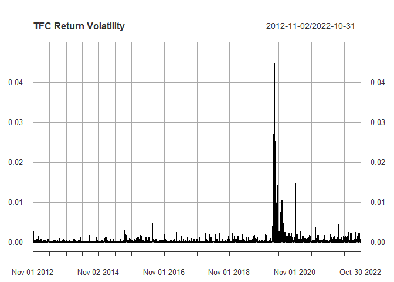

Risk Analysis Using Econometric Models
================
Lindsey Dorson
2022-11-30

## Introduction

The aim of this project is to estimate the market risk of a portfolio
consisting of Direxion Daily S&P 500 Bull 3x Shares ETF (SPXL) and
Truist (TFC) stocks. For this project, the daily log returns of stock
prices (adjusted) from SPXL and Truist were used to create the
portfolio. The daily log returns are calculated from 11/2/2012 to
10/31/2022. Value at Risk (VaR) is used to estimate the probability of
loss at a 99% confidence level for the following days portfolio return.

SPXL is an exchange traded fund that was created to directly compete
with the daily returns of the S&P 500 with a goal of delivering 3x the
daily returns. The S&P 500 is a stock market index that consists of 500
large-cap companies that are traded on American stock exchanges. The
SPXL unlike the S&P 500 invests directly using derivatives to attain
market leverage and is rebalanced daily. As a result the SPXL is
considered highly volatile in comparison to the S&P 500 as well.

Truist is a financial corporation that resulted from the merger of BB&T
and SunTrust. It provides banking and investment services to a variety
of consumers primarily in the Southeast United States (other regions as
well). Truist is also considered one of the largest banks in the United
States and is listed on the S&P 500. Recent data ranks Truist as 237th
by market capitalization value with \$62.25 Billion.

### Explore Data

``` r
library(fGarch)
library(Ecdat)
library(sn)
library(MASS)
library(LambertW)
library(ks)
library(htmlTable)
library(copula)
library(ggplot2)
library(patchwork)
library(pastecs)
library(rugarch)
library(forecast)
library(quantmod)
library(tseries)
library(modelsummary)
```

``` r
## download historical data
getSymbols("SPXL;TFC",
           from = "2012/11/01",
           to = "2022/11/01",
           periodicity = "daily")
```

    ## [1] "SPXL" "TFC"

``` r
## log return conversion
SPXLr<-diff(log(SPXL$SPXL.Adjusted))%>%
  na.omit()
names(SPXLr)<-c("logreturns")

TFCr<-diff(log(TFC$TFC.Adjusted))%>%
  na.omit()
names(TFCr)<-c("logreturns")
```

### SPXL

The SPXL daily stock price was illustrated below for reference but only
the daily log returns are analyzed. The SPXL daily log returns have a
mean of 0.0009 and a standard deviation of 0.03. A density plot of the
log returns indicate they have heavier tails than a normal distribution.

When checking for autocorrelation, the ACF plot displayed significant
lags. An Ljung-Box test was performed on the first 10 lags as well and
gave significant results. Therefore, it is confirmed that the time
series is autocorrelated. To test if the time series is stationary an
Augmented Dickey-Fuller Test (testing for unit roots) was performed and
gave significant results as well therefore the series is stationary.

Next conditional heteroskedasticity in the returns is checked. The SPXL
Volatility plot appears to show some time-varying volatility. However, a
ACF plot and Ljung-Box test was performed on the squared returns to
better test for this. They both support that there is conditional
heteroskedasticity in the returns.

Therefore, it is necessary to model time dependence and the volatility
of the log returns which is common in stock log returns.

``` r
mean(SPXLr)
```

    ## [1] 0.0008995142

``` r
sd(SPXLr)
```

    ## [1] 0.03308501

<!-- -->

    ## integer(0)

``` r
## historical stock price and log returns
par(mfrow = c(2, 1))
plot(SPXL$SPXL.Adjusted, main = "SPXL Adjusted Stock Prices")
plot(SPXLr, main = "SPXL Daily Log Returns")
```

<!-- -->

``` r
plot(SPXLr^2, ylim=c(0,.08),main = "SPXL Return Volatility")
```

<!-- -->

``` r
par(mfrow = c(1, 2))

acf(SPXLr, main= "ACF of SPXL Log Returns")
acf(SPXLr^2, main= "ACF of SPXL Squared Log Returns")
```

<!-- -->

``` r
Box.test(SPXLr, lag=10, type = 'Ljung')
```

    ## 
    ##  Box-Ljung test
    ## 
    ## data:  SPXLr
    ## X-squared = 246.05, df = 10, p-value < 2.2e-16

``` r
adf.test(SPXLr)
```

    ## 
    ##  Augmented Dickey-Fuller Test
    ## 
    ## data:  SPXLr
    ## Dickey-Fuller = -13.228, Lag order = 13, p-value = 0.01
    ## alternative hypothesis: stationary

``` r
Box.test(SPXLr^2, type = 'Ljung')
```

    ## 
    ##  Box-Ljung test
    ## 
    ## data:  SPXLr^2
    ## X-squared = 422.27, df = 1, p-value < 2.2e-16

### TFC

The TFC daily log returns have a mean of 0.0003 and a standard deviation
of 0.02. The log returns also have fat tails. From the ACF plot and
Ljung-Box test we can confirm the time series is autocorrelated. The
Augmented Dickey-Fuller Test concludes that the time series is
stationary as well.

When checking for conditional heteroskedasticity by analyzing the
squared log returns, the ACF plot and Ljung-Box test both support that
there is conditional heteroskedasticity in the log returns.

Therefore, as was concluded with the SPXL log returns, it is necessary
to model time dependence and volatility of the log returns with TFC as
well.

``` r
mean(TFCr)
```

    ## [1] 0.0002931733

``` r
sd(TFCr)
```

    ## [1] 0.01878981

``` r
plot(density(TFCr$logreturns),lwd = 2,"Density Plot of TFC Log Returns") + polygon(density(TFCr$logreturns))
```

<!-- -->

    ## integer(0)

``` r
## historical stock price and log returns
par(mfrow = c(2, 1))
plot(TFC$TFC.Adjusted, main = "TFC Adjusted Stock Prices")
plot(TFCr, main = "TFC Daily Log Returns")
```

<!-- -->

``` r
plot(TFCr^2, ylim=c(0,.05),main = "TFC Return Volatility")
```

<!-- -->

``` r
par(mfrow = c(1, 2))

acf(TFCr, main= "ACF of TFC Log Returns")
acf(TFCr^2, main= "ACF of TFC Squared Log Returns")
```

<!-- -->

``` r
Box.test(SPXLr, lag=10, type = 'Ljung')
```

    ## 
    ##  Box-Ljung test
    ## 
    ## data:  SPXLr
    ## X-squared = 246.05, df = 10, p-value < 2.2e-16

``` r
adf.test(SPXLr)
```

    ## 
    ##  Augmented Dickey-Fuller Test
    ## 
    ## data:  SPXLr
    ## Dickey-Fuller = -13.228, Lag order = 13, p-value = 0.01
    ## alternative hypothesis: stationary

``` r
Box.test(SPXLr^2, type = 'Ljung')
```

    ## 
    ##  Box-Ljung test
    ## 
    ## data:  SPXLr^2
    ## X-squared = 422.27, df = 1, p-value < 2.2e-16

## Creating Time Series Model

### AR(1) + GARCH(1,1)

Since both stocks log returns are time-dependent, stationary, and suffer
from conditional heteroskedasticity the AR(1) + GARCH(1,1) model was
selected to best fit each stocks log returns. It is important to note
that the GARCH component is better suited for financial time series
because it allows for fat tails which is seen in both stocks log
returns.

After fitting each stock to the AR(1) + GARCH(1,1) model, the
standardized residuals and squared standardized residuals were analyzed
to see if the model was well fit. This was done visually with an ACF
plot and a Ljung Box test. The results for both the stocks indicated
that the model was adequately successful in catching the autocorrelation
and heteroscedasticity in the residuals (there are better models to fit
but this one works fine).

``` r
arma.garch = ugarchspec(mean.model=list(armaOrder=c(1,0)),
                        variance.model=list(garchOrder=c(1,1)))

spxl.ar.garch = ugarchfit(data=SPXLr, spec=arma.garch)
show(spxl.ar.garch)
```

    ## 
    ## *---------------------------------*
    ## *          GARCH Model Fit        *
    ## *---------------------------------*
    ## 
    ## Conditional Variance Dynamics    
    ## -----------------------------------
    ## GARCH Model  : sGARCH(1,1)
    ## Mean Model   : ARFIMA(1,0,0)
    ## Distribution : norm 
    ## 
    ## Optimal Parameters
    ## ------------------------------------
    ##         Estimate  Std. Error  t value Pr(>|t|)
    ## mu      0.002416    0.000386   6.2575 0.000000
    ## ar1    -0.058504    0.022525  -2.5974 0.009394
    ## omega   0.000040    0.000005   7.2942 0.000000
    ## alpha1  0.234454    0.023496   9.9784 0.000000
    ## beta1   0.735215    0.021300  34.5172 0.000000
    ## 
    ## Robust Standard Errors:
    ##         Estimate  Std. Error  t value Pr(>|t|)
    ## mu      0.002416    0.000394   6.1285 0.000000
    ## ar1    -0.058504    0.020595  -2.8407 0.004502
    ## omega   0.000040    0.000008   4.7821 0.000002
    ## alpha1  0.234454    0.035274   6.6467 0.000000
    ## beta1   0.735215    0.030392  24.1912 0.000000
    ## 
    ## LogLikelihood : 5724.709 
    ## 
    ## Information Criteria
    ## ------------------------------------
    ##                     
    ## Akaike       -4.5467
    ## Bayes        -4.5351
    ## Shibata      -4.5467
    ## Hannan-Quinn -4.5425
    ## 
    ## Weighted Ljung-Box Test on Standardized Residuals
    ## ------------------------------------
    ##                         statistic p-value
    ## Lag[1]                      2.055  0.1517
    ## Lag[2*(p+q)+(p+q)-1][2]     2.135  0.1713
    ## Lag[4*(p+q)+(p+q)-1][5]     2.928  0.4496
    ## d.o.f=1
    ## H0 : No serial correlation
    ## 
    ## Weighted Ljung-Box Test on Standardized Squared Residuals
    ## ------------------------------------
    ##                         statistic p-value
    ## Lag[1]                   0.008967  0.9246
    ## Lag[2*(p+q)+(p+q)-1][5]  0.771101  0.9089
    ## Lag[4*(p+q)+(p+q)-1][9]  2.372313  0.8562
    ## d.o.f=2
    ## 
    ## Weighted ARCH LM Tests
    ## ------------------------------------
    ##             Statistic Shape Scale P-Value
    ## ARCH Lag[3]  0.001258 0.500 2.000  0.9717
    ## ARCH Lag[5]  1.901491 1.440 1.667  0.4934
    ## ARCH Lag[7]  2.907327 2.315 1.543  0.5312
    ## 
    ## Nyblom stability test
    ## ------------------------------------
    ## Joint Statistic:  1.4099
    ## Individual Statistics:              
    ## mu     0.06874
    ## ar1    0.03988
    ## omega  0.25271
    ## alpha1 0.73120
    ## beta1  0.76092
    ## 
    ## Asymptotic Critical Values (10% 5% 1%)
    ## Joint Statistic:          1.28 1.47 1.88
    ## Individual Statistic:     0.35 0.47 0.75
    ## 
    ## Sign Bias Test
    ## ------------------------------------
    ##                      t-value      prob sig
    ## Sign Bias           3.630038 0.0002890 ***
    ## Negative Sign Bias  0.892384 0.3722724    
    ## Positive Sign Bias  0.003163 0.9974762    
    ## Joint Effect       19.440750 0.0002216 ***
    ## 
    ## 
    ## Adjusted Pearson Goodness-of-Fit Test:
    ## ------------------------------------
    ##   group statistic p-value(g-1)
    ## 1    20     132.0    6.060e-19
    ## 2    30     154.2    5.147e-19
    ## 3    40     180.2    4.967e-20
    ## 4    50     188.2    3.460e-18
    ## 
    ## 
    ## Elapsed time : 0.1592472

``` r
spxle<-residuals(spxl.ar.garch, standardize=TRUE)
spxlfit_t<-fitdistr(spxle,"t")

spxl_para<-spxlfit_t$estimate

u1<-pstd(spxle,mean = spxl_para[1],sd = spxl_para[2],nu = spxl_para[3])%>%
  as.vector()


tfc.ar.garch = ugarchfit(data=TFCr, spec=arma.garch)
show(tfc.ar.garch)
```

    ## 
    ## *---------------------------------*
    ## *          GARCH Model Fit        *
    ## *---------------------------------*
    ## 
    ## Conditional Variance Dynamics    
    ## -----------------------------------
    ## GARCH Model  : sGARCH(1,1)
    ## Mean Model   : ARFIMA(1,0,0)
    ## Distribution : norm 
    ## 
    ## Optimal Parameters
    ## ------------------------------------
    ##         Estimate  Std. Error  t value Pr(>|t|)
    ## mu      0.000621    0.000254   2.4419 0.014612
    ## ar1    -0.021625    0.021815  -0.9913 0.321540
    ## omega   0.000015    0.000002   6.8901 0.000000
    ## alpha1  0.141491    0.011911  11.8790 0.000000
    ## beta1   0.800409    0.008033  99.6387 0.000000
    ## 
    ## Robust Standard Errors:
    ##         Estimate  Std. Error  t value Pr(>|t|)
    ## mu      0.000621    0.000263  2.36421 0.018068
    ## ar1    -0.021625    0.021838 -0.99024 0.322058
    ## omega   0.000015    0.000005  2.79967 0.005116
    ## alpha1  0.141491    0.019030  7.43496 0.000000
    ## beta1   0.800409    0.039212 20.41229 0.000000
    ## 
    ## LogLikelihood : 7049.077 
    ## 
    ## Information Criteria
    ## ------------------------------------
    ##                     
    ## Akaike       -5.5994
    ## Bayes        -5.5878
    ## Shibata      -5.5994
    ## Hannan-Quinn -5.5952
    ## 
    ## Weighted Ljung-Box Test on Standardized Residuals
    ## ------------------------------------
    ##                         statistic p-value
    ## Lag[1]                    0.04647  0.8293
    ## Lag[2*(p+q)+(p+q)-1][2]   0.09276  1.0000
    ## Lag[4*(p+q)+(p+q)-1][5]   0.74107  0.9779
    ## d.o.f=1
    ## H0 : No serial correlation
    ## 
    ## Weighted Ljung-Box Test on Standardized Squared Residuals
    ## ------------------------------------
    ##                         statistic p-value
    ## Lag[1]                     0.0382  0.8450
    ## Lag[2*(p+q)+(p+q)-1][5]    2.3850  0.5307
    ## Lag[4*(p+q)+(p+q)-1][9]    4.1804  0.5586
    ## d.o.f=2
    ## 
    ## Weighted ARCH LM Tests
    ## ------------------------------------
    ##             Statistic Shape Scale P-Value
    ## ARCH Lag[3]    0.2455 0.500 2.000  0.6203
    ## ARCH Lag[5]    1.1198 1.440 1.667  0.6977
    ## ARCH Lag[7]    1.5874 2.315 1.543  0.8037
    ## 
    ## Nyblom stability test
    ## ------------------------------------
    ## Joint Statistic:  45.2387
    ## Individual Statistics:              
    ## mu     0.05123
    ## ar1    0.08794
    ## omega  2.19791
    ## alpha1 2.34432
    ## beta1  2.27271
    ## 
    ## Asymptotic Critical Values (10% 5% 1%)
    ## Joint Statistic:          1.28 1.47 1.88
    ## Individual Statistic:     0.35 0.47 0.75
    ## 
    ## Sign Bias Test
    ## ------------------------------------
    ##                    t-value    prob sig
    ## Sign Bias           0.5122 0.60853    
    ## Negative Sign Bias  1.8870 0.05928   *
    ## Positive Sign Bias  0.1034 0.91763    
    ## Joint Effect        7.0253 0.07110   *
    ## 
    ## 
    ## Adjusted Pearson Goodness-of-Fit Test:
    ## ------------------------------------
    ##   group statistic p-value(g-1)
    ## 1    20     58.63    6.369e-06
    ## 2    30     65.50    1.218e-04
    ## 3    40     90.61    5.466e-06
    ## 4    50    101.09    1.754e-05
    ## 
    ## 
    ## Elapsed time : 0.1964259

``` r
tfce<-residuals(tfc.ar.garch, standardize=TRUE)

tfcfit_t<-fitdistr(tfce,"t")
tfc_para<-tfcfit_t$estimate
u2<-pstd(tfce,mean = tfc_para[1],sd = tfc_para[2],nu = tfc_para[3])%>%
    as.vector()
```

``` r
par(mfrow = c(1, 2))
plot(spxl.ar.garch, which = 10)
plot(spxl.ar.garch, which = 11)
mtext("SPXL",side = 3, line = - 2, outer = TRUE, font = 2)
```

<!-- -->

``` r
par(mfrow = c(1, 1))
plot(spxl.ar.garch, which = 8)
```

<!-- -->

``` r
Box.test(spxle, type = 'Ljung')
```

    ## 
    ##  Box-Ljung test
    ## 
    ## data:  spxle
    ## X-squared = 2.0548, df = 1, p-value = 0.1517

``` r
Box.test(spxle^2, type = 'Ljung')
```

    ## 
    ##  Box-Ljung test
    ## 
    ## data:  spxle^2
    ## X-squared = 0.008967, df = 1, p-value = 0.9246

``` r
par(mfrow = c(1, 2))
plot(tfc.ar.garch, which = 10)
plot(tfc.ar.garch, which = 11)
mtext("TFC",side = 3, line = - 2, outer = TRUE, font = 2)
```

<!-- -->

``` r
par(mfrow = c(1, 1))
plot(tfc.ar.garch, which = 8)
```

<!-- -->

``` r
Box.test(tfce, type = 'Ljung')
```

    ## 
    ##  Box-Ljung test
    ## 
    ## data:  tfce
    ## X-squared = 0.046471, df = 1, p-value = 0.8293

``` r
Box.test(tfce^2, type = 'Ljung')
```

    ## 
    ##  Box-Ljung test
    ## 
    ## data:  tfce^2
    ## X-squared = 0.038201, df = 1, p-value = 0.845

### Fitting Residuals

When observing the standardized residuals with a non-parametric density
plot, we see high dependence in the tail region. Next, each stocks
standardized residuals from the AR(1) + GARCH(1,1) were fit to a
student’s T distribution to find the optimized parameters. Then the
parameters were used to transform both stocks daily standardized
residuals into uniform marginal distributions. Then we fit them to 4
different copulas (t-copula, Gaussian copula, Gumbel Copula, and Clayton
copula) to find the one that gives the lowest AIC. The t-copula ends up
giving the lowest AIC and is used to model the dependency of the
residuals between the two stocks.

``` r
U.hat<-cbind(u1,u2)
### Non-Parametric Density estimation plot
fhatU=kde(x=U.hat,H=Hscv(x=U.hat))
plot(fhatU,cont=seq(10,80,10), main = "Contour plot",xlab = "SPXL Standardized Residuals", ylab = "TFC Standardized Residuals")
```

<!-- -->

``` r
tau=cor.test(as.numeric(u1),as.numeric(u2),method="kendall")$estimate
r=cor.test(as.numeric(u1),as.numeric(u2),method="pearson")$estimate
## estimator for spearman's rho used in copulas
omega=sin((tau*pi)/2)
## Guass
Cgauss <- fitCopula(copula=normalCopula(dim=2),data=U.hat,method="ml",start=c(omega))
guass_para<-coef(Cgauss)

guass_loglike <- loglikCopula(param=guass_para,u=U.hat,copula=normalCopula(dim=2))
guass_AIC <- -2*guass_loglike + 2*length(guass_para)

## T
Ct<-fitCopula(copula=tCopula(dim=2),data=U.hat,method="ml",start=c(omega,10))
t_para<-coef(Ct)

t_loglik<-loglikCopula(param=t_para,u=U.hat,copula=tCopula(dim=2))
t_AIC<- -2*t_loglik + 2*length(t_para)

## Clayton
Cclay <- fitCopula(copula=claytonCopula(dim=2),data=U.hat,method="ml",start=1) 
clay_para <- coef(Cclay)
clay_loglik <- loglikCopula(param=clay_para,u=(U.hat),copula=claytonCopula(dim=2))

clay_AIC<- -2*clay_loglik + 2*length(clay_para)


## Gumbel
Cgum <- fitCopula(copula=gumbelCopula(dim=2),data=U.hat,method="ml",start=1) 
gum_para<-coef(Cgum)

gum_loglik <- loglikCopula(param=gum_para,u=as.matrix(U.hat),copula=gumbelCopula(dim=2)) 
gum_AIC <- -2*gum_loglik + 2*length(gum_para)
```

``` r
Copula<-matrix(nrow = 4, ncol = 1)
Copula[1,]=c(guass_AIC)
Copula[2,]=c(t_AIC) 
Copula[3,]=c(clay_AIC) 
Copula[4,]=c(gum_AIC) 

Copula<-data.frame(Copula)
names<-c("Guassian", "T", "Clayton", "Gumbel")
row.names(Copula) <- names
names(Copula) <- c("AIC")
Copula<-round(Copula,2)

htmlTable(Copula, caption = "Copula Results")
```

<table class="gmisc_table" style="border-collapse: collapse; margin-top: 1em; margin-bottom: 1em;">
<thead>
<tr>
<td colspan="2" style="text-align: left;">
Copula Results
</td>
</tr>
<tr>
<th style="border-bottom: 1px solid grey; border-top: 2px solid grey;">
</th>
<th style="font-weight: 900; border-bottom: 1px solid grey; border-top: 2px solid grey; text-align: center;">
AIC
</th>
</tr>
</thead>
<tbody>
<tr>
<td style="text-align: left;">
Guassian
</td>
<td style="text-align: center;">
-1275.42
</td>
</tr>
<tr>
<td style="text-align: left;">
T
</td>
<td style="text-align: center;">
-1405.19
</td>
</tr>
<tr>
<td style="text-align: left;">
Clayton
</td>
<td style="text-align: center;">
-971.81
</td>
</tr>
<tr>
<td style="border-bottom: 2px solid grey; text-align: left;">
Gumbel
</td>
<td style="border-bottom: 2px solid grey; text-align: center;">
-1251.58
</td>
</tr>
</tbody>
</table>

### Risk Calculation

We then generate a random observation of 10000 residual probabilities
for each stock from the copula while maintaining the joint relationship.
Those probabilities are transformed into standardized residuals for each
stock. These residuals are substituted into the AR(1) + GARCH(1,1) to
predict the following periods log return. Then the Value-at-Risk (VaR)
is calculated for different portfolio allocations between SPXL and TFC
at a 99% confidence. The Var Table below illustrates the results.

``` r
set.seed(1234)
#generate a random sample with size n from the fitted t copula
Sim_prob <- rCopula(copula = tCopula(t_para[1], df = t_para[2], dim = 2), n = 10000)
Sim_prob <-data.frame(Sim_prob)
names(Sim_prob)<-c("SPXL","TFC")

#transform marginals into the estimated skewed t
Sim_SPXLe <- qstd(Sim_prob[,1],mean = spxl_para[1],sd = spxl_para[2],nu = spxl_para[3])

Sim_TFCe <- qstd(Sim_prob[,2],mean = tfc_para[1],sd = tfc_para[2],nu = tfc_para[3])
```

``` r
# sigma for next period
spxl_model<-coef(spxl.ar.garch)
tfc_model<-coef(tfc.ar.garch)

sigma1spxl<- sqrt(spxl_model[3]+(spxl_model[4]*(tail(spxle,1)^2))+(spxl_model[5]*(tail(sigma(spxl.ar.garch),1)^2
)))%>%as.numeric()

sigma1tfc<- sqrt(tfc_model[3]+(tfc_model[4]*(tail(tfce,1)^2))+(tfc_model[5]*(tail(sigma(tfc.ar.garch),1)^2
)))%>%as.numeric()

## log return
spxlr0 <- as.numeric(tail(SPXLr,1))
spxl1<-spxl_model[1]+(spxl_model[2]*(spxlr0))+(sigma1spxl*Sim_SPXLe)

tfcr0 <- as.numeric(tail(TFCr,1))
tfc1<-tfc_model[1]+(tfc_model[2]*(tfcr0))+(sigma1tfc*Sim_TFCe)


## store Var in table 
rho<-c(0.1,0.2,0.3,0.4,0.5,0.6,0.7,0.8,0.9)
n=length(rho)


vartable<-matrix(data=NA,nrow=9,ncol=2)
vartable[,1]<-rho
fill= rep(NA,9)
for(i in 1:n){
  fill[i]<- (rho[i]*(spxl1)+((1-rho[i])*(tfc1)))%>%
  quantile(0.01)*-1
  vartable[,2]<-fill
}
vartable<-data.frame(vartable)
names(vartable)<-c('SPXL Weight','VaR')
vartable<-round(vartable,3)

htmlTable(vartable, caption = "VaR Table")
```

<table class="gmisc_table" style="border-collapse: collapse; margin-top: 1em; margin-bottom: 1em;">
<thead>
<tr>
<td colspan="3" style="text-align: left;">
VaR Table
</td>
</tr>
<tr>
<th style="border-bottom: 1px solid grey; border-top: 2px solid grey;">
</th>
<th style="font-weight: 900; border-bottom: 1px solid grey; border-top: 2px solid grey; text-align: center;">
SPXL Weight
</th>
<th style="font-weight: 900; border-bottom: 1px solid grey; border-top: 2px solid grey; text-align: center;">
VaR
</th>
</tr>
</thead>
<tbody>
<tr>
<td style="text-align: left;">
1
</td>
<td style="text-align: center;">
0.1
</td>
<td style="text-align: center;">
0.23
</td>
</tr>
<tr>
<td style="text-align: left;">
2
</td>
<td style="text-align: center;">
0.2
</td>
<td style="text-align: center;">
0.244
</td>
</tr>
<tr>
<td style="text-align: left;">
3
</td>
<td style="text-align: center;">
0.3
</td>
<td style="text-align: center;">
0.262
</td>
</tr>
<tr>
<td style="text-align: left;">
4
</td>
<td style="text-align: center;">
0.4
</td>
<td style="text-align: center;">
0.282
</td>
</tr>
<tr>
<td style="text-align: left;">
5
</td>
<td style="text-align: center;">
0.5
</td>
<td style="text-align: center;">
0.299
</td>
</tr>
<tr>
<td style="text-align: left;">
6
</td>
<td style="text-align: center;">
0.6
</td>
<td style="text-align: center;">
0.318
</td>
</tr>
<tr>
<td style="text-align: left;">
7
</td>
<td style="text-align: center;">
0.7
</td>
<td style="text-align: center;">
0.345
</td>
</tr>
<tr>
<td style="text-align: left;">
8
</td>
<td style="text-align: center;">
0.8
</td>
<td style="text-align: center;">
0.369
</td>
</tr>
<tr>
<td style="border-bottom: 2px solid grey; text-align: left;">
9
</td>
<td style="border-bottom: 2px solid grey; text-align: center;">
0.9
</td>
<td style="border-bottom: 2px solid grey; text-align: center;">
0.4
</td>
</tr>
</tbody>
</table>

## Conclusion

The Var Table indicates that as the portfolio allocates more weight to
SPXL the VaR increases. Therefore, to have the minimal VaR 10% of the
portfolio should be allocated to SPXL and 90% should be Truist stocks.
At those weights we can be 99% certain that losses will not exceed .23
cents per dollar spent. These results are not surprising considering
SPXL historically has had high daily volatility and is considered high
risk as result. Portfolios should not invest that much into SPXL or
similar ETFs to reduce risk.
